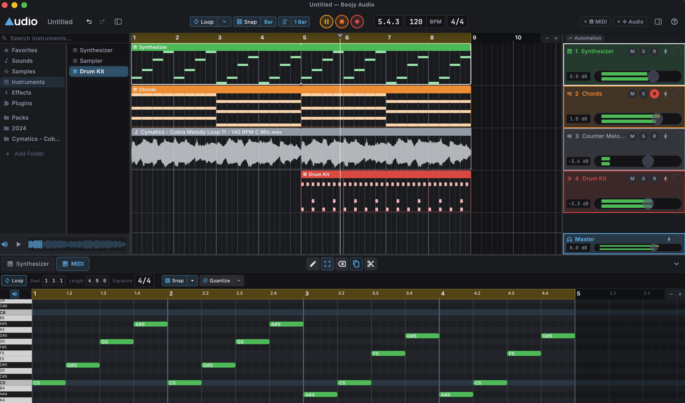

# Boojy Audio

**Make music with less setup and distraction.**

Boojy Audio is a free, open-source digital audio workstation for combining beats, melodies and
recorded performances into complete songs. Play instruments, draw notes, record vocals, arrange
and mix, all in a calm interface with sensible defaults. It's designed for musicians: sound comes
first, and the visuals are there to support listening.



## Download

[](https://github.com/boojyorg/boojy-audio/releases/latest)
[](https://github.com/boojyorg/boojy-audio/releases/latest)

Latest release: **v0.6.0**. More at [boojy.org](https://boojy.org).

**Alpha software.** Boojy is actively developed and some workflows are still incomplete. The
[changelog](CHANGELOG.md) lists what changed in each release, and the
[backlog](docs/BACKLOG.md) is honest about what's missing. The screenshot above is from the
released build.

## What you can do

- **Compose.** Play the built-in synth, sampler and drum kit from a MIDI keyboard or the virtual
  piano, draw notes in the piano roll, and program drum patterns in the step sequencer.
- **Record.** Capture vocals and instruments with input monitoring, a count-in and punch in/out.
  A phrase you played before pressing record can be captured after the fact.
- **Arrange and edit.** Move, trim, split, join, loop and time-stretch audio and MIDI clips on
  a linear timeline. Undo is unlimited and edits are non-destructive.
- **Mix.** Balance tracks with faders and pan, use the built-in EQ, compressor, reverb, delay
  and limiter, automate volume, and host VST3 instruments and effects.
- **Save and export.** Projects auto-save. Export a mix or individual stems to WAV or MP3, and
  MIDI clips to standard `.mid` files.

## Build from source

This section is for developers. You don't need any of it to use Boojy: download a release above.

You'll need Rust and Flutter. Both are pinned to exact versions in the repo (Rust in
`engine/rust-toolchain.toml`, Flutter in `ui/.fvmrc`), so install [rustup](https://rustup.rs)
and [FVM](https://fvm.app) and they'll pick up the right ones. On macOS you also need the Xcode
Command Line Tools.

```bash
git clone https://github.com/boojyorg/boojy-audio.git
cd boojy-audio
./build.sh                  # builds the Rust engine and links it into the app
cd ui
fvm install                 # first time only: fetches the pinned Flutter SDK
fvm flutter run -d macos
```

Windows builds also need the VST3 host libraries compiled with Visual Studio; the steps are in
[`engine/vst3_host/README.md`](engine/vst3_host/README.md). Engineering conventions, build
gates and the rules files live in [AGENTS.md](AGENTS.md).

## Documentation

| Doc | What it covers |
| --- | --- |
| [PRODUCT.md](docs/PRODUCT.md) | What Boojy is for and the principles that decide what goes in |
| [BACKLOG.md](docs/BACKLOG.md) | What's next, what's parked, and decisions already made |
| [ARCHITECTURE.md](docs/ARCHITECTURE.md) | How the Flutter UI and Rust engine fit together |
| [RELEASING.md](docs/RELEASING.md) | How a release is cut and checked |
| [CHANGELOG.md](CHANGELOG.md) | What changed, release by release |

## Keyboard shortcuts

The full list is behind the **?** button in the transport bar (or press `?`). The ones you'll
reach for first:

| Shortcut | Action |
| --- | --- |
| Space | Play / pause |
| R | Start / stop recording |
| L | Toggle loop |
| M | Toggle metronome |
| Q | Quantise selected |
| Cmd+J | Join clips |
| Cmd+L / Cmd+M / Cmd+E | Toggle library / mixer / editor panel |
| Cmd+P | Virtual piano |
| Cmd+Z / Shift+Cmd+Z | Undo / redo |

## Feedback and licence

Boojy Audio is a personal project and isn't taking code contributions or pull requests right now
(see [CONTRIBUTING.md](CONTRIBUTING.md)). Bug reports and feedback are very welcome by email at
[tyr@boojy.org](mailto:tyr@boojy.org).

Licensed under the [GNU General Public License v3.0](LICENSE). Copyright 2025–2026 Tyr Bujac.
